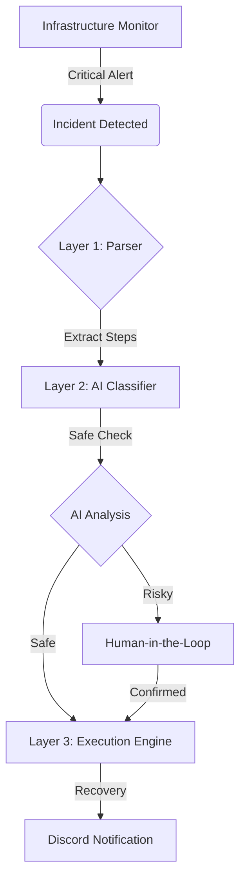

   
  
  <h1>🚀 RUNBOOK AGENT</h1>
  <h3>Autonomous Incident Resolution Engine</h3>
  
<i>The Bridge Between AI Reasoning and Infrastructure Recovery</i>

  

    
    
    
    
  

   

---

### 🛡️ What is RUNBOOK AGENT?
An enterprise-grade autonomous IT operations agent that detects, classifies, and resolves infrastructure failures in real-time. By combining the **Model Context Protocol (MCP)** with **Llama 3 reasoning**, it executes operational runbooks with safety-first precision.

---

## 🏛️ Intelligence Architecture

---

## 🏛️ Three-Layer Autonomy Stack
1.  **Layer 1 · Intelligent Parser**: Transforms Markdown instructions into structured executable JSON pipelines.
2.  **Layer 2 · AI Classifier (LLM)**: Uses Llama 3 to analyze the "Blast Radius" of every command to distinguish between `SAFE` (Reads) and `RISKY` (Restarts/Kills).
3.  **Layer 3 · MCP Execution Engine**: A secure shell executor with a strict security allowlist to prevent unauthorized system modification.

---

## 💬 Incident Resolution Flow
> **[09:00] MONITOR** → 🔴 High CPU Usage Detected (>95%)
>
> **[09:01] AGENT**   → 🔍 Triggered `high_cpu.md`
>
> **[09:01] AGENT**   → 🧠 AI Logic: "Finding top processes is SAFE. Killing PID 1234 is RISKY."
>
> **[09:02] AGENT**   → ⚠️ Paused for human confirmation.
>
> **[09:02] USER**    → ✅ Confirmed.
>
> **[09:03] AGENT**   → 🟢 Resolved. CPU load normalized to 15%.

---

## 📁 Project Structure
*   **`backend/`**: FastAPI logic, Agent Control Loop, and MCP Tooling.
*   **`frontend/`**: Real-time Glassmorphism Dashboard.
*   **`runbooks/`**: Standard markdown operational intelligence.
*   **`.env`**: Centralized configuration management.

---

## 🚀 Quick Start
1.  **Clone**: `git clone <repo-url> && cd opsbot-ai`
2.  **Config**: `cp .env.example .env` (Add your Discord Webhook)
3.  **AI**: `ollama pull llama3`
4.  **Run**: `python -m uvicorn backend.main:app --reload --port 8000`

---

  Built with ❤️ by Team AI Ops

